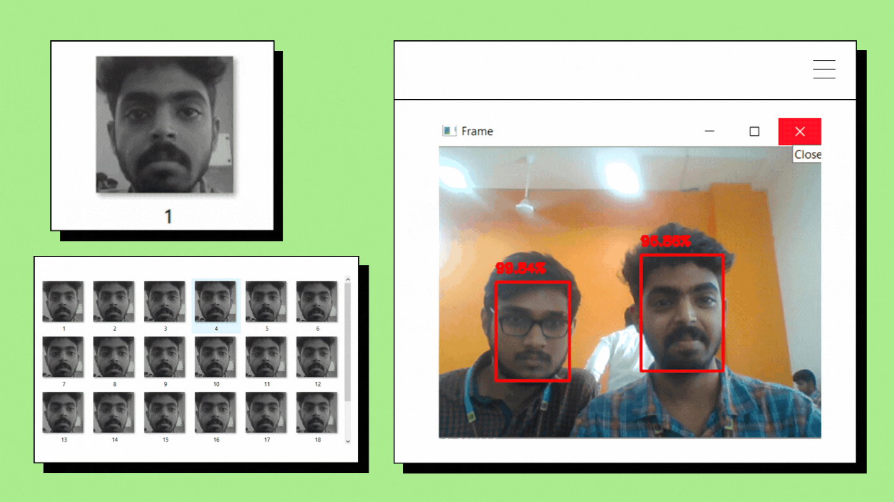

# Object Recognition with Raspberry-Pi

### Real-Time Face Recognition with Raspberry Pi 3

Developed a real-time face recognition system using OpenCV, NumPy, and Dlib, and deployed it on a Raspberry Pi 3. The system was designed to detect and recognize faces in real-time, displaying confidence scores for each identified face within bounding boxes. This feature improves the system's accuracy by providing users with more reliable identification.

